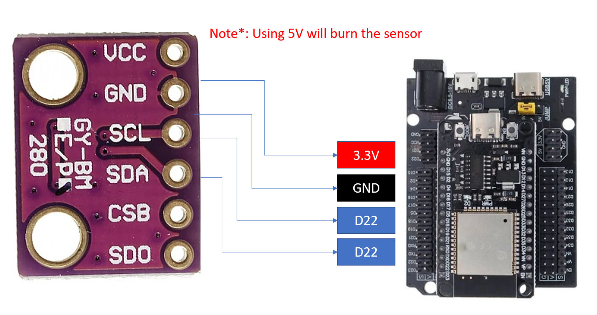

# 🌡️ BMP280 Sensor with ESP32 (MicroPython)





The **BMP280** is a **digital barometric pressure and temperature sensor** designed by **Bosch Sensortec**.  
It offers accurate readings of **atmospheric pressure**, **temperature**, and can estimate **altitude** making it ideal for **weather stations**, **drones**, **IoT monitoring systems**, and **environmental projects**.

---

## 🧭 Overview

The **BMP280** sensor provides reliable and high-resolution data while consuming minimal power.  
It communicates via **I²C** or **SPI**, allowing easy integration with microcontrollers such as **ESP32**, **ESP8266**, and **Arduino**.

| Feature | Description |
|----------|--------------|
| **Pressure Range** | 300 – 1100 hPa |
| **Temperature Range** | –40 °C to +85 °C |
| **Accuracy** | ±1 hPa (≈ ±8 m altitude) |
| **Operating Voltage** | 1.8 V – 3.6 V (3.3 V typical) |
| **Communication** | I²C or SPI |
| **Power Consumption** | Ultra-low, ideal for IoT |

---

## 🧠 How It Works

The BMP280 measures **absolute atmospheric pressure** using a piezo-resistive sensor.  
From pressure and temperature, it calculates the **altitude** using the **barometric formula**:


## 🧩 Applications

- 🌤️ **Weather monitoring systems**  
- 🚁 **Drone altitude tracking**  
- 🏕️ **Outdoor environmental sensing**  
- 🏠 **Smart home & IoT dashboards**  
- 🧪 **Educational sensor experiments**

---

## 🔌 Pinout (I²C Mode)

| BMP280 Pin | Description | ESP32 Pin |
|-------------|-------------|------------|
| **VCC** | Power supply | 3.3 V |
| **GND** | Ground | GND |
| **SCL** | Serial clock | GPIO 22 |
| **SDA** | Serial data | GPIO 21 |

> ⚠️ Some BMP280 modules (e.g., **GY-BMP280**) include a voltage regulator and can accept **5 V**.  
> The original Bosch BMP280 chip itself supports only **3.3 V** logic.

---

## 🧰 Requirements

- **Hardware:**
  - ESP32 or ESP8266 microcontroller  
  - BMP280 sensor module  
  - Jumper wires  

- **Software:**
  - [Thonny IDE](https://thonny.org/)  
  - MicroPython firmware installed on ESP32  
  - `bmp280.py` driver uploaded to the board  (You can find the library in the Lab3 and save it in Micropython)

---

## 💻 MicroPython Example Code

```python
from machine import Pin, I2C
from bmp280 import BMP280
import time

i2c = I2C(0, scl=Pin(22), sda=Pin(21))
bmp = BMP280(i2c, addr=0x76)

while True:
    print("Temperature (°C):", bmp.temperature)
    print("Pressure (hPa):", bmp.pressure / 100)
    print("Altitude (m):", bmp.altitude)
    print("------------------")
    time.sleep(2)
```

## 🌐 MQTT Communication Overview

**MQTT (Message Queuing Telemetry Transport)** is a lightweight, publish–subscribe messaging protocol widely used in **IoT (Internet of Things)** systems.  
It enables small, low-power devices like the **ESP32** to send data efficiently to servers or cloud platforms over the Internet or a local network.

---

### ⚙️ How MQTT Works

MQTT is based on a **publisher–broker–subscriber** model:

- **Publisher:** sends messages (for example, the ESP32 publishing BMP280 data)
- **Broker:** the central server that receives and distributes messages (e.g., Mosquitto, HiveMQ, or test.mosquitto.org)
- **Subscriber:** any client that listens for messages on specific topics (for example, a dashboard or another ESP32)

Each message is sent to a **topic**, which acts like an address for that data stream.  
Example topic structure:

