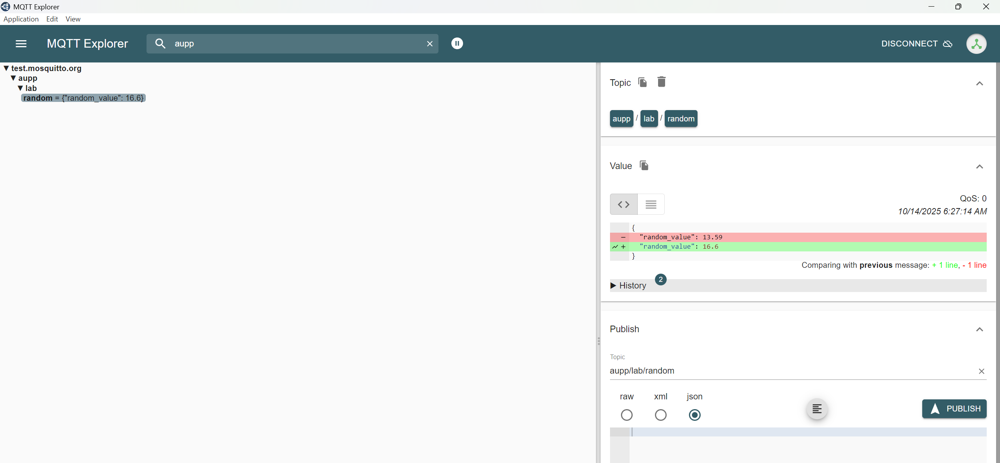

# 🌡️ BMP280 Sensor with ESP32 (MicroPython)


The **BMP280** is a **digital barometric pressure and temperature sensor** designed by **Bosch Sensortec**.  
It offers accurate readings of **atmospheric pressure**, **temperature**, and can estimate **altitude** making it ideal for **weather stations**, **drones**, **IoT monitoring systems**, and **environmental projects**.

---

## 🧭 Overview

The **BMP280** sensor provides reliable and high-resolution data while consuming minimal power.  
It communicates via **I²C** or **SPI**, allowing easy integration with microcontrollers such as **ESP32**, **ESP8266**, and **Arduino**.

| Feature | Description |
|----------|--------------|
| **Pressure Range** | 300 – 1100 hPa |
| **Temperature Range** | –40 °C to +85 °C |
| **Accuracy** | ±1 hPa (≈ ±8 m altitude) |
| **Operating Voltage** | 1.8 V – 3.6 V (3.3 V typical) |
| **Communication** | I²C or SPI |
| **Power Consumption** | Ultra-low, ideal for IoT |

---

## 🧠 How It Works

The BMP280 measures **absolute atmospheric pressure** using a piezo-resistive sensor.  
From pressure and temperature, it calculates the **altitude** using the **barometric formula**:


## 🧩 Applications

- 🌤️ **Weather monitoring systems**  
- 🚁 **Drone altitude tracking**  
- 🏕️ **Outdoor environmental sensing**  
- 🏠 **Smart home & IoT dashboards**  
- 🧪 **Educational sensor experiments**

---

## 🔌 Pinout (I²C Mode)

| BMP280 Pin | Description | ESP32 Pin |
|-------------|-------------|------------|
| **VCC** | Power supply | 3.3 V |
| **GND** | Ground | GND |
| **SCL** | Serial clock | GPIO 22 |
| **SDA** | Serial data | GPIO 21 |

> ⚠️ Some BMP280 modules (e.g., **GY-BMP280**) include a voltage regulator and can accept **5 V**.  
> The original Bosch BMP280 chip itself supports only **3.3 V** logic.

---

## 🧰 Requirements

- **Hardware:**
  - ESP32 or ESP8266 microcontroller  
  - BMP280 sensor module  
  - Jumper wires  

- **Software:**
  - [Thonny IDE](https://thonny.org/)  
  - MicroPython firmware installed on ESP32  
  - `bmp280.py` driver uploaded to the board  (You can find the library in the Lab3 and save it in Micropython)

---

## 💻 MicroPython Example Code

```python
from machine import Pin, I2C
from bmp280 import BMP280
import time

i2c = I2C(0, scl=Pin(22), sda=Pin(21))
bmp = BMP280(i2c, addr=0x76)

while True:
    print("Temperature (°C):", bmp.temperature)
    print("Pressure (hPa):", bmp.pressure / 100)
    print("Altitude (m):", bmp.altitude)
    print("------------------")
    time.sleep(2)
```

## 🌐 MQTT Communication Overview

**MQTT (Message Queuing Telemetry Transport)** is a lightweight, publish–subscribe messaging protocol widely used in **IoT (Internet of Things)** systems.  
It enables small, low-power devices like the **ESP32** to send data efficiently to servers or cloud platforms over the Internet or a local network.

---

### ⚙️ How MQTT Works

MQTT is based on a **publisher–broker–subscriber** model:

- **Publisher:** sends messages (for example, the ESP32 publishing BMP280 data)
- **Broker:** the central server that receives and distributes messages (e.g., Mosquitto, HiveMQ, or test.mosquitto.org)
- **Subscriber:** any client that listens for messages on specific topics (for example, a dashboard or another ESP32)


---

### 🧠 Key Concepts

| Term | Description |
|------|--------------|
| **Broker** | The MQTT server that routes messages between clients |
| **Topic** | A hierarchical string that identifies the data (e.g., `home/livingroom/temp`) |
| **Publish** | Sending a message to a topic |
| **Subscribe** | Listening for messages from a topic |
| **QoS (Quality of Service)** | Level of message delivery guarantee (0, 1, or 2) |
| **Retain Flag** | Keeps the last published message available for new subscribers |
| **Last Will and Testament (LWT)** | A message sent automatically if a client disconnects unexpectedly |

---

### 💡 Why Use MQTT

- 🚀 **Lightweight:** Minimal bandwidth and power usage  
- 🔁 **Bi-directional:** Devices can both send and receive messages  
- 🧩 **Scalable:** Supports many clients easily  
- 📡 **Reliable:** Works well over unstable networks  
- 🌍 **Compatible:** Supported by most IoT platforms (AWS IoT, ThingsBoard, Node-RED, etc.)

---

### 🧩 Common MQTT Brokers

| Broker Type | Example | Description |
|--------------|----------|-------------|
| **Public** | `test.mosquitto.org` | Free for testing, no login required |
| **Local** | Mosquitto on Raspberry Pi or PC | Great for LAN IoT setups |
| **Cloud** | HiveMQ, Adafruit IO, AWS IoT Core | Reliable for production IoT projects |

---

### 🖥️ How It Fits in This Project

The ESP32 connects to Wi-Fi and publishes **random numeric values (10–20)** to a chosen **MQTT topic** every few seconds.  
It works with any MQTT broker (public or private).


## 💻 Example Code

```python
# main.py — Publish random 10–20 to MQTT broker (test.mosquitto.org)
import network, time, json, random
from umqtt.simple import MQTTClient

# ===== Wi-Fi credentials =====
WIFI_SSID = "TP-LINK_56C612"
WIFI_PASS = "06941314"

# ===== MQTT setup =====
MQTT_BROKER = "test.mosquitto.org"   # public test broker
MQTT_PORT   = 1883                   # default MQTT port
CLIENT_ID   = b"esp32-random"
TOPIC       = b"aupp/lab/random"     # your custom topic

# ===== Connect Wi-Fi =====
def wifi_connect():
    wlan = network.WLAN(network.STA_IF)
    wlan.active(True)
    if not wlan.isconnected():
        print("Connecting to Wi-Fi…")
        wlan.connect(WIFI_SSID, WIFI_PASS)
        t0 = time.ticks_ms()
        while not wlan.isconnected():
            if time.ticks_diff(time.ticks_ms(), t0) > 15000:
                raise RuntimeError("Wi-Fi timeout")
            time.sleep(0.2)
    print("Wi-Fi connected:", wlan.ifconfig())

# ===== Main =====
def main():
    wifi_connect()

    # Connect to MQTT broker
    print("Connecting to MQTT broker…")
    client = MQTTClient(CLIENT_ID, MQTT_BROKER, port=MQTT_PORT, keepalive=30)
    client.connect()
    print("Connected to MQTT broker:", MQTT_BROKER)

    # Publish random values
    while True:
        value = round(random.uniform(10, 20), 2)
        payload = json.dumps({"random_value": value})
        client.publish(TOPIC, payload)
        print("Published to", TOPIC.decode(), ":", payload)
        time.sleep(5)

if __name__ == "__main__":
    main()

```

You can download the mqtt explorer from the link below
- [MQTT Explorer](https://github.com/thomasnordquist/MQTT-Explorer/releases/tag/v0.4.0-beta.6)
After that you go to mqtt explorer and connect to test.mosquitto.org, after that you search for the aupp you will see the data as shown in the image below



# 🌩️ ESP32 → ThingsBoard Cloud (MQTT Telemetry) using MicroPython

## 🧭 How This Project Fits Into Your IoT Setup

This project shows how to connect an **ESP32** board (running **MicroPython**) to **ThingsBoard Cloud** via **MQTT**.  
It’s the **first step** in building an Internet of Things (IoT) system where your microcontroller sends live sensor data to a cloud dashboard.

You can later extend it to:
- Send real sensor values (temperature, water level, etc.)
- Build dashboards and gauges in ThingsBoard
- Add control features (turn devices on/off via MQTT commands)

This example uses **random values (10–20)** to simulate sensor data — making it a perfect starting point before integrating real sensors like DHT22, BMP280, or flow meters.

---

## 🚀 Overview

Your ESP32 will:
1. Connect to Wi-Fi  
2. Connect securely to **ThingsBoard Cloud** using MQTT  
3. Publish random values (10–20) every 5 seconds  
4. Display those values in your ThingsBoard dashboard

You can monitor your device in the **ThingsBoard Web Dashboard** under **Latest Telemetry**.
